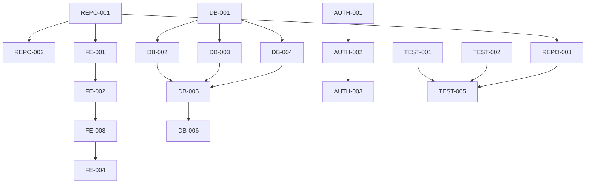

# ExamPrep Platform - Expanded Task Breakdown with Agent Mapping

## Parsed from PRD.txt - Skeleton & Scaffolding Phase (Expanded with Subtasks)

### Legend
- **Main Tasks**: Primary deliverables from PRD
- **Subtasks**: Detailed breakdown of complex tasks (Medium-High complexity)
- **Agent Notation**: Primary agent / Secondary agent (if multi-agent task)

| Task ID | Task Description | Phase/Category | Agent Assignment | Priority | Dependencies | Acceptance Criteria |
|---------|-----------------|----------------|------------------|----------|--------------|-------------------|
| **REPO-001** | Initialize GitHub repository structure | Repository Setup | devops-infrastructure | High | None | GitHub repo created with proper folder structure |
| **REPO-002** | Setup branch protection rules (main, develop) | Repository Setup | devops-infrastructure | High | REPO-001 | Branch protection configured, PR required for main |
| **REPO-003** | Configure GitHub Actions workflows | CI/CD | devops-infrastructure | High | REPO-001 | Workflows for lint, test, deploy created |
| **REPO-003.1** | → Create basic workflow structure | CI/CD Subtask | devops-infrastructure | High | REPO-001 | Basic .github/workflows directory and files |
| **REPO-003.2** | → Configure lint and typecheck workflows | CI/CD Subtask | devops-infrastructure / qa-examprep-validator | High | REPO-003.1 | ESLint and TypeScript checks in CI |
| **REPO-003.3** | → Setup test automation workflows | CI/CD Subtask | devops-infrastructure / qa-examprep-validator | High | REPO-003.2 | Jest and Playwright tests in CI |
| **REPO-003.4** | → Configure deployment workflows | CI/CD Subtask | devops-infrastructure | High | REPO-003.3 | Auto-deploy to Vercel on merge |
| **REPO-003.5** | → Setup environment-specific workflows | CI/CD Subtask | devops-infrastructure | Medium | REPO-003.4 | Staging vs production workflows |
| **REPO-004** | Setup environment variable management | Infrastructure | devops-infrastructure / security-shield | High | REPO-001 | GitHub secrets configured, no secrets in repo |
| **REPO-004.1** | → Define environment variable structure | Infrastructure Subtask | devops-infrastructure / security-shield | High | REPO-001 | .env.example with all required vars |
| **REPO-004.2** | → Configure GitHub repository secrets | Infrastructure Subtask | devops-infrastructure | High | REPO-004.1 | Production secrets in GitHub |
| **REPO-004.3** | → Setup local development environment | Infrastructure Subtask | devops-infrastructure | Medium | REPO-004.1 | Local .env setup instructions |
| **FE-001** | Initialize Next.js application scaffold | Frontend Setup | frontend-examprep | High | REPO-001 | Next.js app created with TypeScript |
| **FE-001.1** | → Create Next.js project with TypeScript | Frontend Subtask | frontend-examprep | High | REPO-001 | Next.js 14 with TypeScript configured |
| **FE-001.2** | → Configure project structure and folders | Frontend Subtask | frontend-examprep | High | FE-001.1 | Standard folder structure (app, components, lib) |
| **FE-001.3** | → Setup TypeScript configuration | Frontend Subtask | frontend-examprep | High | FE-001.2 | Strict TypeScript settings |
| **FE-001.4** | → Configure Next.js app router | Frontend Subtask | frontend-examprep | Medium | FE-001.3 | App router structure setup |
| **FE-002** | Install and configure TailwindCSS | Frontend Setup | frontend-examprep | High | FE-001 | TailwindCSS installed and configured |
| **FE-003** | Install and configure shadcn/ui components | Frontend Setup | frontend-examprep | High | FE-002 | shadcn/ui components library integrated |
| **FE-003.1** | → Install shadcn/ui CLI and initialize | Frontend Subtask | frontend-examprep | High | FE-002 | shadcn/ui CLI setup complete |
| **FE-003.2** | → Configure component theming | Frontend Subtask | frontend-examprep | High | FE-003.1 | Custom theme variables configured |
| **FE-003.3** | → Install essential UI components | Frontend Subtask | frontend-examprep | Medium | FE-003.2 | Button, Input, Card components installed |
| **FE-004** | Create basic page scaffolds | Frontend Setup | frontend-examprep | Medium | FE-003 | Basic page structure created |
| **FE-005** | Configure Next.js security headers | Frontend Security | frontend-examprep / security-shield | High | FE-001 | Security headers configured in next.config.js |
| **FE-005.1** | → Define security header policies | Frontend Security Subtask | security-shield | High | FE-001 | CSP, HSTS, and other security policies defined |
| **FE-005.2** | → Implement headers in Next.js config | Frontend Security Subtask | frontend-examprep | High | FE-005.1 | Security headers in next.config.js |
| **FE-005.3** | → Test security header implementation | Frontend Security Subtask | qa-examprep-validator | Medium | FE-005.2 | Security headers verified in browser |
| **DB-001** | Setup Supabase project connection | Database Setup | database-architect | High | None | Supabase project connected |
| **DB-002** | Create users table schema | Database Schema | database-architect | High | DB-001 | Users table with proper columns created |
| **DB-002.1** | → Design user table structure | Database Subtask | database-architect | High | DB-001 | User schema with all required fields |
| **DB-002.2** | → Create user table with constraints | Database Subtask | database-architect | High | DB-002.1 | Table created with proper constraints |
| **DB-002.3** | → Setup user table indexes | Database Subtask | database-architect | Medium | DB-002.2 | Performance indexes on email, role |
| **DB-003** | Create subscriptions table schema | Database Schema | database-architect | High | DB-001 | Subscriptions table with proper relationships |
| **DB-003.1** | → Design subscription business logic | Database Subtask | database-architect / examprep-backend-api | High | DB-001 | Subscription model defined |
| **DB-003.2** | → Create subscriptions table with relationships | Database Subtask | database-architect | High | DB-003.1, DB-002.2 | Subscriptions table with FK to users |
| **DB-003.3** | → Add subscription status constraints | Database Subtask | database-architect | Medium | DB-003.2 | Status enums and validation rules |
| **DB-004** | Create change_logs table schema | Database Schema | database-architect | High | DB-001 | Change logs table for task tracking |
| **DB-005** | Create database migrations | Database Migrations | database-architect | High | DB-002, DB-003, DB-004 | Migration files created and tested |
| **DB-005.1** | → Create migration file structure | Database Subtask | database-architect | High | DB-002, DB-003, DB-004 | Migration files for all tables |
| **DB-005.2** | → Implement migration rollback procedures | Database Subtask | database-architect | High | DB-005.1 | Rollback scripts for all migrations |
| **DB-005.3** | → Test migrations on staging database | Database Subtask | database-architect / devops-infrastructure | High | DB-005.2 | Migrations tested and verified |
| **DB-005.4** | → Create migration deployment scripts | Database Subtask | database-architect / devops-infrastructure | Medium | DB-005.3 | Automated migration deployment |
| **DB-006** | Implement Row Level Security policies | Database Security | database-architect / security-shield | High | DB-005 | RLS policies for all tables implemented |
| **DB-006.1** | → Design RLS policy architecture | Database Security Subtask | security-shield / database-architect | High | DB-005 | RLS strategy document |
| **DB-006.2** | → Implement user table RLS policies | Database Security Subtask | database-architect | High | DB-006.1 | RLS policies for users table |
| **DB-006.3** | → Implement subscription RLS policies | Database Security Subtask | database-architect | High | DB-006.2 | RLS policies for subscriptions |
| **DB-006.4** | → Implement change_logs RLS policies | Database Security Subtask | database-architect | High | DB-006.3 | RLS policies for audit logs |
| **DB-006.5** | → Test RLS policies with different roles | Database Security Subtask | database-architect / qa-examprep-validator | High | DB-006.4 | RLS policies validated for all user roles |
| **AUTH-001** | Setup Supabase Auth configuration | Authentication | auth-guardian | High | DB-001 | Supabase Auth configured |
| **AUTH-001.1** | → Configure Supabase Auth providers | Authentication Subtask | auth-guardian | High | DB-001 | Email and OAuth providers configured |
| **AUTH-001.2** | → Setup authentication flow templates | Authentication Subtask | auth-guardian | Medium | AUTH-001.1 | Login, signup, reset templates |
| **AUTH-001.3** | → Configure session management | Authentication Subtask | auth-guardian | High | AUTH-001.2 | Session timeout and refresh logic |
| **AUTH-002** | Implement role-based access control | Authentication | auth-guardian / database-architect | High | DB-002, AUTH-001 | RBAC system implemented |
| **AUTH-002.1** | → Define user role hierarchy | Authentication Subtask | auth-guardian / security-shield | High | DB-002 | Role definitions and permissions |
| **AUTH-002.2** | → Implement role assignment logic | Authentication Subtask | auth-guardian | High | AUTH-002.1 | Role assignment and updates |
| **AUTH-002.3** | → Create role-based route protection | Authentication Subtask | auth-guardian | High | AUTH-002.2 | Protected routes by role |
| **AUTH-002.4** | → Test RBAC with different user types | Authentication Subtask | auth-guardian / qa-examprep-validator | High | AUTH-002.3 | RBAC tested across all roles |
| **AUTH-003** | Create authentication middleware | Authentication | auth-guardian / frontend-examprep | High | AUTH-001 | Auth middleware for protected routes |
| **AUTH-003.1** | → Design middleware architecture | Authentication Subtask | auth-guardian | High | AUTH-001 | Middleware design and flow |
| **AUTH-003.2** | → Implement server-side auth middleware | Authentication Subtask | auth-guardian | High | AUTH-003.1 | API route protection middleware |
| **AUTH-003.3** | → Implement client-side auth guards | Authentication Subtask | auth-guardian / frontend-examprep | High | AUTH-003.2 | Client-side route guards |
| **AUTH-003.4** | → Test middleware with protected routes | Authentication Subtask | auth-guardian / qa-examprep-validator | Medium | AUTH-003.3 | Middleware tested end-to-end |
| **STORAGE-001** | Create Supabase storage buckets for PBQ assets | Storage Setup | storage-manager | Medium | DB-001 | PBQ assets bucket created |
| **STORAGE-002** | Create Supabase storage buckets for blog media | Storage Setup | storage-manager | Medium | DB-001 | Blog media bucket created |
| **STORAGE-003** | Implement RBAC access policies for storage | Storage Security | storage-manager / security-shield | High | STORAGE-001, STORAGE-002 | Storage access policies configured |
| **STORAGE-003.1** | → Design storage access policy framework | Storage Security Subtask | security-shield / storage-manager | High | STORAGE-001, STORAGE-002 | Storage security policy design |
| **STORAGE-003.2** | → Implement PBQ asset access policies | Storage Security Subtask | storage-manager | High | STORAGE-003.1 | PBQ storage access rules |
| **STORAGE-003.3** | → Implement blog media access policies | Storage Security Subtask | storage-manager | High | STORAGE-003.2 | Blog media access rules |
| **STORAGE-003.4** | → Test storage policies with different roles | Storage Security Subtask | storage-manager / qa-examprep-validator | Medium | STORAGE-003.3 | Storage access tested by role |
| **API-001** | Setup API route structure | Backend API | examprep-backend-api | Medium | FE-001 | API routes folder structure created |
| **API-002** | Create Supabase client configuration | Backend API | examprep-backend-api / database-architect | High | DB-001 | Supabase client properly configured |
| **API-002.1** | → Configure server-side Supabase client | Backend API Subtask | examprep-backend-api | High | DB-001 | Server Supabase client setup |
| **API-002.2** | → Configure client-side Supabase client | Backend API Subtask | examprep-backend-api / frontend-examprep | High | API-002.1 | Client Supabase client setup |
| **API-002.3** | → Setup Supabase client error handling | Backend API Subtask | examprep-backend-api | Medium | API-002.2 | Error handling for DB operations |
| **API-003** | Implement change log API endpoints | Backend API | examprep-backend-api / task-orchestrator | High | DB-004 | CRUD operations for change logs |
| **API-003.1** | → Design change log API schema | Backend API Subtask | examprep-backend-api / task-orchestrator | High | DB-004 | API endpoint specification |
| **API-003.2** | → Implement CRUD operations | Backend API Subtask | examprep-backend-api | High | API-003.1 | Full CRUD API for change logs |
| **API-003.3** | → Add API validation and error handling | Backend API Subtask | examprep-backend-api | Medium | API-003.2 | Input validation and error responses |
| **SEC-001** | Define comprehensive RLS policies | Security | security-shield / database-architect | High | DB-005 | Security policies documented and implemented |
| **SEC-001.1** | → Audit database security requirements | Security Subtask | security-shield | High | DB-005 | Security requirements analysis |
| **SEC-001.2** | → Design comprehensive RLS strategy | Security Subtask | security-shield / database-architect | High | SEC-001.1 | RLS policy framework |
| **SEC-001.3** | → Document security policy implementation | Security Subtask | security-shield | High | SEC-001.2 | Security policies documented |
| **SEC-001.4** | → Create security testing procedures | Security Subtask | security-shield / qa-examprep-validator | Medium | SEC-001.3 | Security test cases |
| **SEC-002** | Implement secrets management strategy | Security | security-shield / devops-infrastructure | High | REPO-004 | No secrets in code, proper env var usage |
| **SEC-002.1** | → Audit current secrets usage | Security Subtask | security-shield | High | REPO-004 | Secrets audit report |
| **SEC-002.2** | → Implement secure secrets storage | Security Subtask | security-shield / devops-infrastructure | High | SEC-002.1 | Secrets in proper env management |
| **SEC-002.3** | → Create secrets rotation procedures | Security Subtask | security-shield / devops-infrastructure | Medium | SEC-002.2 | Key rotation documentation |
| **SEC-003** | Create security baseline documentation | Security | security-shield | Medium | SEC-001, SEC-002 | Security documentation created |
| **TEST-001** | Setup Jest testing framework | Testing | qa-examprep-validator | High | FE-001 | Jest configured and working |
| **TEST-001.1** | → Install and configure Jest | Testing Subtask | qa-examprep-validator | High | FE-001 | Jest installed with Next.js integration |
| **TEST-001.2** | → Setup testing utilities and helpers | Testing Subtask | qa-examprep-validator | High | TEST-001.1 | Test utilities and mock helpers |
| **TEST-001.3** | → Create sample unit tests | Testing Subtask | qa-examprep-validator | Medium | TEST-001.2 | Example tests for components |
| **TEST-002** | Setup Playwright E2E testing | Testing | qa-examprep-validator | High | FE-001 | Playwright configured for E2E tests |
| **TEST-002.1** | → Install and configure Playwright | Testing Subtask | qa-examprep-validator | High | FE-001 | Playwright setup with browsers |
| **TEST-002.2** | → Create E2E test framework | Testing Subtask | qa-examprep-validator | High | TEST-002.1 | Page objects and test structure |
| **TEST-002.3** | → Setup test data management | Testing Subtask | qa-examprep-validator / database-architect | High | TEST-002.2 | Test database and data fixtures |
| **TEST-002.4** | → Create authentication E2E tests | Testing Subtask | qa-examprep-validator / auth-guardian | Medium | TEST-002.3 | Login/logout E2E test scenarios |
| **TEST-003** | Setup axe-core accessibility testing | Testing | qa-examprep-validator | Medium | TEST-002 | Accessibility testing integrated |
| **TEST-003.1** | → Install axe-core testing tools | Testing Subtask | qa-examprep-validator | Medium | TEST-002 | Axe-core integrated with Playwright |
| **TEST-003.2** | → Create accessibility test suite | Testing Subtask | qa-examprep-validator / frontend-examprep | Medium | TEST-003.1 | Accessibility tests for key pages |
| **TEST-004** | Create test plan template | Testing | qa-examprep-validator | Medium | None | Test plan template documented |
| **TEST-005** | Configure CI testing hooks | Testing | qa-examprep-validator / devops-infrastructure | High | REPO-003, TEST-001, TEST-002 | Tests run automatically in CI |
| **TEST-005.1** | → Integrate unit tests in CI | Testing Subtask | qa-examprep-validator / devops-infrastructure | High | REPO-003, TEST-001 | Jest tests in GitHub Actions |
| **TEST-005.2** | → Integrate E2E tests in CI | Testing Subtask | qa-examprep-validator / devops-infrastructure | High | TEST-005.1, TEST-002 | Playwright tests in CI |
| **TEST-005.3** | → Setup test result reporting | Testing Subtask | qa-examprep-validator / devops-infrastructure | Medium | TEST-005.2 | Test results and coverage reports |
| **CONFIG-001** | Setup Prettier configuration | Code Quality | devops-infrastructure | Medium | FE-001 | Prettier configured and working |
| **CONFIG-002** | Setup ESLint configuration | Code Quality | devops-infrastructure | Medium | FE-001 | ESLint configured with proper rules |
| **CONFIG-003** | Configure TypeScript strict mode | Code Quality | devops-infrastructure / frontend-examprep | High | FE-001 | TypeScript strict mode enabled |
| **CONFIG-003.1** | → Enable strict TypeScript settings | Code Quality Subtask | frontend-examprep | High | FE-001 | Strict mode configuration |
| **CONFIG-003.2** | → Fix existing TypeScript errors | Code Quality Subtask | frontend-examprep | High | CONFIG-003.1 | All TypeScript errors resolved |
| **CONFIG-003.3** | → Setup TypeScript path mapping | Code Quality Subtask | frontend-examprep | Medium | CONFIG-003.2 | Import aliases configured |
| **DEPLOY-001** | Setup Vercel deployment pipeline | Deployment | devops-infrastructure | High | REPO-003 | Auto-deploy to Vercel configured |
| **DEPLOY-001.1** | → Connect repository to Vercel | Deployment Subtask | devops-infrastructure | High | REPO-003 | Vercel project linked to GitHub |
| **DEPLOY-001.2** | → Configure deployment environments | Deployment Subtask | devops-infrastructure | High | DEPLOY-001.1 | Production and preview environments |
| **DEPLOY-001.3** | → Setup environment variables in Vercel | Deployment Subtask | devops-infrastructure / security-shield | Medium | DEPLOY-001.2 | All env vars configured in Vercel |
| **DEPLOY-002** | Configure Supabase migrations in CI | Deployment | devops-infrastructure / database-architect | High | DB-005, REPO-003 | Migrations run automatically |
| **DEPLOY-002.1** | → Setup migration CI workflow | Deployment Subtask | devops-infrastructure | High | DB-005, REPO-003 | Migration workflow in GitHub Actions |
| **DEPLOY-002.2** | → Configure staging database migrations | Deployment Subtask | devops-infrastructure / database-architect | High | DEPLOY-002.1 | Staging migration automation |
| **DEPLOY-002.3** | → Configure production migration safety | Deployment Subtask | devops-infrastructure / database-architect | High | DEPLOY-002.2 | Production migration safeguards |
| **DEPLOY-003** | Setup staging environment | Deployment | devops-infrastructure | Medium | DEPLOY-001 | Staging environment configured |
| **DEPLOY-003.1** | → Create staging Vercel environment | Deployment Subtask | devops-infrastructure | Medium | DEPLOY-001 | Staging deployment configuration |
| **DEPLOY-003.2** | → Setup staging database | Deployment Subtask | devops-infrastructure / database-architect | Medium | DEPLOY-003.1 | Staging database instance |
| **DEPLOY-003.3** | → Configure staging-specific settings | Deployment Subtask | devops-infrastructure | Medium | DEPLOY-003.2 | Staging environment variables |
| **DOCS-001** | Create auto-updating change log system | Documentation | task-orchestrator / examprep-backend-api | High | API-003 | Change log auto-updates from DB |
| **DOCS-001.1** | → Design change log automation architecture | Documentation Subtask | task-orchestrator | High | API-003 | Change log system design |
| **DOCS-001.2** | → Implement database to markdown conversion | Documentation Subtask | task-orchestrator / examprep-backend-api | High | DOCS-001.1 | DB data to markdown logic |
| **DOCS-001.3** | → Setup automated file generation | Documentation Subtask | task-orchestrator | High | DOCS-001.2 | Automated markdown file updates |
| **DOCS-001.4** | → Test change log automation | Documentation Subtask | task-orchestrator / qa-examprep-validator | Medium | DOCS-001.3 | Change log automation verified |
| **DOCS-002** | Setup change log markdown generation | Documentation | task-orchestrator | High | DOCS-001 | Markdown file auto-generated |
| **DOCS-002.1** | → Create markdown template system | Documentation Subtask | task-orchestrator | High | DOCS-001 | Markdown templates for change logs |
| **DOCS-002.2** | → Implement template rendering | Documentation Subtask | task-orchestrator | Medium | DOCS-002.1 | Template to markdown conversion |
| **DOCS-003** | Create repository documentation structure | Documentation | task-orchestrator | Medium | REPO-001 | README and docs folder structure |
| **PAYMENTS-001** | Setup Stripe placeholder configuration | Payments | payments-stripe-agent | Low | None | Stripe keys in env (placeholder) |

## Task Dependencies Flow

## Agent Workload Distribution (Expanded with Subtasks)

| Agent | Main Tasks | Subtasks | Total Tasks | Primary Agent | Secondary Agent | Priority Distribution |
|-------|------------|----------|-------------|---------------|-----------------|----------------------|
| devops-infrastructure | 8 | 16 | 24 | 22 | 2 | High: 18, Medium: 6 |
| frontend-examprep | 5 | 8 | 13 | 11 | 2 | High: 9, Medium: 4 |
| database-architect | 6 | 13 | 19 | 17 | 2 | High: 17, Medium: 2 |
| auth-guardian | 3 | 11 | 14 | 12 | 2 | High: 12, Medium: 2 |
| qa-examprep-validator | 5 | 11 | 16 | 11 | 5 | High: 11, Medium: 5 |
| security-shield | 3 | 9 | 12 | 8 | 4 | High: 9, Medium: 3 |
| storage-manager | 3 | 4 | 7 | 6 | 1 | High: 3, Medium: 4 |
| examprep-backend-api | 3 | 7 | 10 | 8 | 2 | High: 7, Medium: 3 |
| task-orchestrator | 3 | 6 | 9 | 9 | 0 | High: 7, Medium: 2 |
| payments-stripe-agent | 1 | 0 | 1 | 1 | 0 | Low: 1 |

### Multi-Agent Collaboration Tasks
- **REPO-003**: devops-infrastructure + qa-examprep-validator (CI/CD workflows)
- **REPO-004**: devops-infrastructure + security-shield (Environment management)
- **FE-005**: frontend-examprep + security-shield + qa-examprep-validator (Security headers)
- **DB-003**: database-architect + examprep-backend-api (Subscription logic)
- **DB-005**: database-architect + devops-infrastructure (Migration deployment)
- **DB-006**: database-architect + security-shield + qa-examprep-validator (RLS policies)
- **AUTH-002**: auth-guardian + security-shield + qa-examprep-validator (RBAC implementation)
- **AUTH-003**: auth-guardian + frontend-examprep + qa-examprep-validator (Auth middleware)
- **STORAGE-003**: storage-manager + security-shield + qa-examprep-validator (Storage policies)
- **API-002**: examprep-backend-api + database-architect + frontend-examprep (Supabase client)
- **API-003**: examprep-backend-api + task-orchestrator (Change log API)
- **SEC-001**: security-shield + database-architect + qa-examprep-validator (RLS policies)
- **SEC-002**: security-shield + devops-infrastructure (Secrets management)
- **TEST-002**: qa-examprep-validator + database-architect + auth-guardian (E2E testing)
- **TEST-003**: qa-examprep-validator + frontend-examprep (Accessibility testing)
- **TEST-005**: qa-examprep-validator + devops-infrastructure (CI testing)
- **CONFIG-003**: devops-infrastructure + frontend-examprep (TypeScript strict mode)
- **DEPLOY-001**: devops-infrastructure + security-shield (Vercel deployment)
- **DEPLOY-002**: devops-infrastructure + database-architect (Migration CI)
- **DEPLOY-003**: devops-infrastructure + database-architect (Staging environment)
- **DOCS-001**: task-orchestrator + examprep-backend-api + qa-examprep-validator (Change log automation)

## Critical Path Tasks (High Priority)

1. **REPO-001** → **FE-001** → **DB-001** → **AUTH-001** (Foundation)
2. **DB-002, DB-003, DB-004** → **DB-005** → **DB-006** (Database Schema)
3. **REPO-003** → **TEST-005** → **DEPLOY-001** (CI/CD Pipeline)
4. **SEC-001** → **SEC-002** (Security Baseline)

## Success Criteria Validation

Each task includes acceptance criteria that align with the PRD success criteria:
- ✅ Repo fully bootstrapped
- ✅ Agent-specific feature branches possible
- ✅ Change log system operational
- ✅ Deployment pipeline functional
- ✅ No secrets in repository