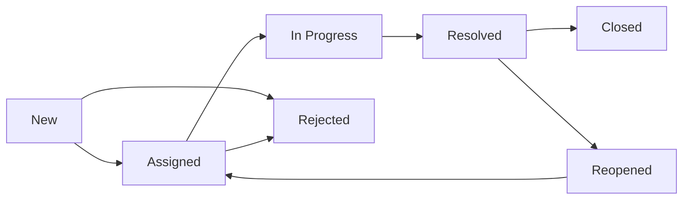

# Bug Report Templates & Procedures - ExamPrep Platform

**Document Version**: 1.0  
**Created**: September 2025  
**QA Agent**: Claude QA Agent

## Overview

This document establishes standardized bug reporting templates, classification procedures, and workflow management for the ExamPrep platform to ensure efficient defect tracking and resolution.

## 1. Bug Report Template

### 1.1 Standard Bug Report Format

````markdown
# Bug Report: [BUG-###] - [Brief Description]

## Bug Information

- **Bug ID**: BUG-[###] (auto-generated)
- **Reporter**: [Agent/User name]
- **Date Reported**: [Date]
- **Component**: [Frontend/Backend/Database/Integration/Infrastructure]
- **Feature**: [Specific feature affected]
- **Severity**: Critical | High | Medium | Low
- **Priority**: P1 | P2 | P3 | P4
- **Status**: New | Assigned | In Progress | Resolved | Closed | Reopened
- **Assignee**: [Developer/Agent responsible]
- **Browser/Device**: [If applicable]
- **Environment**: Local | Staging | Production

## Summary

[One-sentence description of the bug]

## Description

[Detailed description of the issue, including what was expected vs. what actually happened]

## Steps to Reproduce

1. [First step]
2. [Second step]
3. [Third step]
4. [Continue as needed]

## Expected Behavior

[What should have happened]

## Actual Behavior

[What actually happened]

## Screenshots/Videos

[Include visual evidence if applicable]

- Screenshot 1: [Description]
- Video: [Link to recording]

## Environment Details

- **Operating System**: [Windows/macOS/Linux version]
- **Browser**: [Chrome/Firefox/Safari version]
- **Screen Resolution**: [If UI-related]
- **Mobile Device**: [If mobile-specific]
- **Network Conditions**: [If relevant]

## Test Data Used

```json
{
  "user_email": "test.user@example.com",
  "subscription_plan": "30-day",
  "question_id": "12345",
  "exam_attempt_id": "attempt-789"
}
```
````

## Error Messages/Logs

```
[Console errors, server logs, or error messages]
```

## Impact Assessment

- **User Impact**: [How many users affected, severity of impact]
- **Business Impact**: [Revenue, exam integrity, user experience]
- **Workaround Available**: Yes/No - [If yes, describe workaround]

## Related Information

- **Related Bug Reports**: [Links to similar issues]
- **Related Test Cases**: [Test cases that failed]
- **Git Commit**: [If tied to specific deployment]
- **Pull Request**: [If related to recent changes]

## Additional Context

[Any other relevant information, assumptions, or context]

## Attachments

- [ ] Error logs
- [ ] Network traces
- [ ] Database state snapshots
- [ ] Configuration files

````

## 2. Bug Classification System

### 2.1 Severity Levels

#### Critical
- **Definition**: System completely unusable, data loss, security breach
- **Examples**:
  - Exam results not saved/lost
  - Payment processed but subscription not activated
  - User data exposed to unauthorized users
  - Complete system crash/unavailability
- **Response Time**: Immediate (within 1 hour)
- **Resolution Target**: Same day

#### High
- **Definition**: Core functionality broken, major user workflow blocked
- **Examples**:
  - Cannot start/complete exams
  - Login/authentication failures
  - Subscription purchase failures
  - Admin panel inaccessible
- **Response Time**: Within 4 hours
- **Resolution Target**: Within 24 hours

#### Medium
- **Definition**: Feature partially broken, workaround available
- **Examples**:
  - Question navigation issues
  - Performance degradation
  - Minor UI/UX problems
  - Non-critical integrations failing
- **Response Time**: Within 1 business day
- **Resolution Target**: Within 1 week

#### Low
- **Definition**: Cosmetic issues, minor inconveniences
- **Examples**:
  - Typos or text formatting issues
  - Minor visual inconsistencies
  - Non-functional enhancements
  - Documentation errors
- **Response Time**: Within 3 business days
- **Resolution Target**: Next release cycle

### 2.2 Priority Levels

#### P1 - Critical Business Impact
- Production system down
- Security vulnerability
- Data integrity compromised
- Revenue-blocking issues

#### P2 - High Business Impact
- Core features unavailable
- Significant user experience degradation
- Integration failures affecting key workflows

#### P3 - Medium Business Impact
- Feature issues with workarounds
- Performance problems
- Minor functionality gaps

#### P4 - Low Business Impact
- Cosmetic issues
- Enhancement requests
- Documentation improvements

## 3. Component-Specific Bug Templates

### 3.1 Exam Mode Bug Report

```markdown
## Exam Mode Bug Report

### Exam Context
- **Exam Type**: Practice | Full Exam (90Q)
- **Domain**: [Specific CompTIA A+ domain]
- **Question Number**: [Current question when bug occurred]
- **Time Remaining**: [Timer state]
- **Attempt Number**: [If multiple attempts]

### Navigation State
- **Questions Answered**: [X/90]
- **Questions Flagged**: [Number flagged]
- **Last Action**: [Navigate, flag, strikeout, etc.]

### Timer Behavior
- **Timer Running**: Yes/No
- **Time Started**: [Timestamp]
- **Expected Remaining**: [Calculated time]
- **Actual Remaining**: [Displayed time]

### Specific Issue
[Detailed description of exam-specific problem]
````

### 3.2 Payment/Subscription Bug Report

```markdown
## Payment/Subscription Bug Report

### Payment Details

- **Plan Selected**: [30-day, 60-day, 90-day, 180-day]
- **Payment Method**: [Credit card, PayPal]
- **Amount**: [Expected vs. charged]
- **Currency**: [USD, EUR, etc.]

### Stripe Information

- **Payment Intent ID**: [pi_xxxxxxxx]
- **Subscription ID**: [sub_xxxxxxxx]
- **Customer ID**: [cus_xxxxxxxx]
- **Webhook Events**: [List of received webhooks]

### Flow State

- **Checkout Step**: [Started, completed, failed]
- **Redirect Behavior**: [Successful return to app]
- **Subscription Activation**: [Successful/failed]

### Database State

- **User Subscription Record**: [Current state in DB]
- **Plan Limits**: [Applied correctly or not]
- **Billing History**: [Payment recorded]
```

### 3.3 Authentication Bug Report

```markdown
## Authentication Bug Report

### Auth Method

- **Login Type**: Email/password | OAuth (Google, GitHub)
- **User Role**: User | SME | Editor | Admin
- **Session State**: [Authenticated, expired, invalid]

### Flow Context

- **First Login**: Yes/No
- **Password Reset**: Recently performed
- **Multi-tab Session**: Active sessions in other tabs
- **Device Switch**: Logged in on multiple devices

### Security Context

- **JWT Token**: [Valid/expired/malformed]
- **Session Duration**: [How long session was active]
- **Permissions**: [What user was trying to access]
```

## 4. Bug Workflow & Status Management

### 4.1 Bug Lifecycle



### 4.2 Status Definitions

| Status      | Definition                             | Next Actions                          |
| ----------- | -------------------------------------- | ------------------------------------- |
| New         | Bug reported, awaiting triage          | Review, classify, assign              |
| Assigned    | Assigned to developer/agent            | Begin investigation and fix           |
| In Progress | Actively being worked on               | Continue development, provide updates |
| Resolved    | Fix implemented, awaiting verification | QA verification, deploy to test       |
| Closed      | Verified as fixed, deployed            | Monitor for regression                |
| Reopened    | Issue persists after fix attempt       | Re-investigate, reassign              |
| Rejected    | Not a valid bug or won't fix           | Document reason, close                |

### 4.3 Assignment Rules

| Component      | Primary Assignee     | Backup Assignee |
| -------------- | -------------------- | --------------- |
| Frontend UI/UX | Frontend Agent       | QA Agent        |
| Backend API    | Backend Agent        | Database Agent  |
| Database       | Database Agent       | Backend Agent   |
| Authentication | Authentication Agent | Security Agent  |
| Payments       | Payments Agent       | Backend Agent   |
| Infrastructure | DevOps Agent         | Backend Agent   |
| Security       | Security Agent       | DevOps Agent    |

## 5. Bug Verification Procedures

### 5.1 Verification Checklist

#### Pre-Resolution Verification

- [ ] Bug reproduced in test environment
- [ ] Root cause identified and documented
- [ ] Impact assessment completed
- [ ] Fix approach reviewed and approved

#### Post-Resolution Verification

- [ ] Fix verified in test environment
- [ ] Regression testing completed
- [ ] Performance impact assessed
- [ ] Documentation updated (if needed)
- [ ] Related test cases updated

#### Deployment Verification

- [ ] Fix deployed to staging
- [ ] Smoke tests passed
- [ ] Bug verified as fixed in staging
- [ ] Ready for production deployment

### 5.2 Regression Testing Requirements

#### Critical/High Bugs

- Full regression suite execution
- Specific test cases for affected functionality
- Cross-browser/device validation
- Performance benchmark comparison

#### Medium/Low Bugs

- Smoke test suite execution
- Focused testing on affected area
- Single browser validation sufficient

## 6. Bug Metrics & Reporting

### 6.1 Key Metrics

#### Discovery Metrics

- **Bug Discovery Rate**: Bugs found per week/release
- **Defect Density**: Bugs per lines of code/feature points
- **Escape Rate**: Production bugs not caught in testing

#### Resolution Metrics

- **Resolution Time**: Average time from report to fix
- **First-Time Fix Rate**: Percentage of bugs fixed on first attempt
- **Reopened Rate**: Percentage of bugs that reopen

#### Quality Metrics

- **Severity Distribution**: Breakdown by Critical/High/Medium/Low
- **Component Distribution**: Which areas have most bugs
- **Root Cause Analysis**: Common causes of defects

### 6.2 Regular Reports

#### Daily Bug Report

```markdown
## Daily Bug Summary - [Date]

### New Bugs: [Count]

- Critical: [Count]
- High: [Count]
- Medium: [Count]
- Low: [Count]

### Resolved Bugs: [Count]

### Critical Issues Outstanding: [Count]

### Average Resolution Time: [X] hours

### Top Issues:

1. [Most critical open bug]
2. [Second most critical]
3. [Third most critical]
```

#### Weekly Bug Analysis

- Trend analysis (increasing/decreasing bug rates)
- Component analysis (which areas need attention)
- Team performance metrics
- Process improvement recommendations

## 7. Integration with Development Workflow

### 7.1 GitHub Integration

#### Issue Templates

```yaml
name: Bug Report
about: Create a report to help us improve
title: "[BUG] Brief description"
labels: ["bug", "needs-triage"]
assignees: ""

body:
  - type: dropdown
    id: severity
    attributes:
      label: Severity
      options:
        - Critical
        - High
        - Medium
        - Low
    validations:
      required: true

  - type: input
    id: component
    attributes:
      label: Component
      placeholder: Frontend/Backend/Database/etc.
    validations:
      required: true
```

#### Automated Workflows

- Bug triage automation based on labels
- Assignment based on component affected
- Status updates triggered by PR merges
- Slack/email notifications for critical bugs

### 7.2 MCP Integration

#### GitHub MCP

- Automated bug report creation from test failures
- PR status updates when bugs are resolved
- Issue linking between bugs and code changes

#### Supabase MCP

- Database state snapshots for bug reproduction
- User data anonymization for bug reports
- Schema validation for data-related bugs

#### Stripe MCP

- Payment transaction debugging information
- Webhook event correlation with bug reports
- Test mode recreation of payment issues

## 8. Quality Assurance Procedures

### 8.1 Bug Report Quality Review

#### Review Checklist

- [ ] Title clearly describes the issue
- [ ] Reproduction steps are clear and complete
- [ ] Expected vs actual behavior documented
- [ ] Appropriate severity and priority assigned
- [ ] Component correctly identified
- [ ] Environment details sufficient
- [ ] Supporting evidence attached

#### Common Review Issues

- Vague descriptions that can't be reproduced
- Missing environment or configuration details
- Incorrect severity/priority classification
- Duplicate reports not identified
- Missing impact assessment

### 8.2 Resolution Quality Gates

#### Definition of Fixed

- [ ] Root cause identified and documented
- [ ] Fix implemented with code review
- [ ] Unit tests added/updated
- [ ] Integration tests verify fix
- [ ] No regression introduced
- [ ] Performance impact acceptable
- [ ] Documentation updated if needed

## 9. Training & Best Practices

### 9.1 Bug Reporting Training

#### For Developers/Agents

- How to write clear, actionable bug reports
- Proper classification and prioritization
- Using debugging tools effectively
- Root cause analysis techniques

#### For QA Team

- Bug triage and classification
- Verification procedures
- Quality gates enforcement
- Metrics analysis and reporting

### 9.2 Best Practices

#### Reporting Best Practices

- Report bugs immediately when found
- One bug per report (don't combine multiple issues)
- Provide minimal reproduction steps
- Include all relevant context
- Use consistent terminology

#### Resolution Best Practices

- Fix root cause, not just symptoms
- Add regression tests for all fixes
- Document fix approach in PR
- Verify fix doesn't break other functionality
- Update bug report with resolution details

---

**Document Control**

- **Author**: QA Agent (Claude)
- **Version**: 1.0
- **Last Updated**: September 2025
- **Next Review**: October 2025

This bug report template and procedure system ensures consistent, thorough defect tracking and efficient resolution workflows for the ExamPrep platform.
